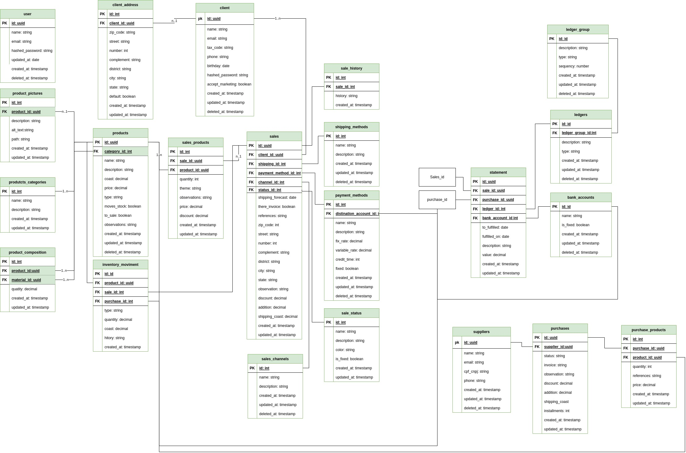

  
  # Artesanias ERP
  

 <a href="#-sobre-o-projeto">Sobre</a> •
  <a href="#-funcionalidades">Funcionalidades</a> •
 <a href="#-esquema-do-banco-de-dados">Esquema do banco de dados</a> • 
 <a href="#-tecnologias">Tecnologias</a> • 
 <a href="#-como-contribuir-para-o-projeto">Como contribuir</a> • 
 <a href="#-licença">Licença</a>
  

## 💻 Sobre o projeto
O projeto consiste em uma API Rest desenvolvida como back-end para um ERP de uma empresa fabricante de produtos de encadernação personalizada.

Neste repositório está disponivel apenas uma parte que foi construida para validação, antes de se tornar um projeto privado da empresa.

## 🧰 Funcionalidades
- Módulo financeiro;
- Módulo de vendas e clientes;
- Módulo de compras e fornecedores;
- Controle de estoque;
- Controle de acesso e segurança.

## 📃 Esquema do banco de dados

## 🚀 Como executar o projeto
### Pré-requisitos
Para executar o projeto, você vai precisar ter instalado em sua máquina as seguintes ferramentas: [Git](https://git-scm.com), [Node.js](https://nodejs.org/en/). Além disto é bom ter um editor para trabalhar com o código como [VSCode](https://code.visualstudio.com/).

## 🛠️ Tecnologias utilizadas
- **[Node](https://nodejs.org/)**;
- **[Typescript](https://www.typescriptlang.org/)**;
- **[Express](https://www.npmjs.com/package/express)**;
- **[Axios](https://axios-http.com/)** - Realiza a comunicação com o backend por meio de requisições HTTP;
- **[Bcrypt](https://www.npmjs.com/package/bcrypt)** - Encriptação de senhas;
- **[DayJS](https://day.js.org/)** - Biblioteca para manipulação de datas;
- **[Multer](https://www.npmjs.com/package/multer)** - Upload e leitura de arquivos;
- **[tsyringe](https://github.com/microsoft/tsyringe)** - Injeção de dependências;
- **[TypeORM](https://typeorm.io/)** - Conexão e comunicação com o banco de dados;
- **[Jest](https://jestjs.io/pt-BR/)** - Testes automatizados.
> Veja o arquivo [package.json](package.json)

**Utilitários**
- Esquema do banco de dados: **[Draw.io](draw.io)**;
- Editor:  **[Visual Studio Code](https://code.visualstudio.com/)**;

## 💪 Como contribuir para o projeto
1. Faça um **fork** do projeto.
2. Crie uma nova branch com as suas alterações: `git checkout -b my-feature`
3. Salve as alterações e crie uma mensagem de commit contando o que você fez: `git commit -m "feature: My new feature"`
4. Envie as suas alterações: `git push origin my-feature`

## 📝 Licença
Este projeto está sobe a licença MIT.

